# ERP Sales & Marketing Management Module

## 📌 Project Overview

A Next.js-based ERP frontend for sales and marketing operations, built to work with a backend API for leads, customers, opportunities, quotations, orders, reports, KPI tracking, and user management.

This project is the client application for a role-based business workflow where different users can manage pipeline data, track performance, approve requests, and review operational metrics from a single dashboard.

**Live URL:** `https://erp-system-frontend-roan.vercel.app`    
**Live API:** `https://erp-system-backend-coral.vercel.app`  

---

## 👥 Roles & Permissions

| Role | Key Capabilities |
|------|-----------------|
| **ADMIN** | Full access — manage users, services, products, pricing, see all data org-wide, view audit logs |
| **MANAGER** | Team-level access — manage own team's leads/customers/quotations/orders, approve price requests, view team KPIs |
| **MARKETING** | Self-only access — own leads, customers, opportunities, quotations, orders, activities, surveys |

---

## 🛠️ Tech Stack

| Layer | Technology |
| --- | --- |
| Framework | Next.js 16.3.6 |
| Language | TypeScript |
| UI | React 19 + Tailwind CSS v4 |
| Component Library | shadcn/ui |
| Data Fetching | TanStack Query |
| State Management | Zustand |
| Forms | React Hook Form + Zod |
| HTTP Client | Axios |
| Charts | Recharts |
| Icons | Lucide React |
| Notifications | Sonner |
| Styling | Tailwind CSS |

---

## ✨ Features

- Public landing page with marketing-style sections, CTA flow, and brand-focused homepage layout
- JWT-based authentication with login, session persistence, demo-role shortcuts, and automatic token refresh
- Role-specific access for Admin, Manager, and Marketing users through a shared protected dashboard shell
- Dashboard navigation and module-based layout for sales and marketing operations
- Leads management and conversion workflow from inquiry to customer lifecycle
- Customer records with lead linkage and profile tracking
- Opportunities management with pipeline stages and progress tracking
- Activity logging for calls, meetings, follow-ups, and engagement history
- Survey lifecycle management from pending to scheduled to completed states
- Quotation creation, approval, rejection, and conversion flow
- Order management with draft-to-confirmed-to-completed status progression
- Catalog management for services, categories, products, and pricing
- KPI and target tracking by role with performance comparison views
- Sales and marketing reporting with filters, summaries, and analytics views
- User administration and audit log review for oversight and compliance
- Reusable shadcn/ui design system with Tailwind styling and responsive mobile-friendly layout

### Core Business Modules
- **User Hierarchy** — Admin → Manager → Marketing with team-scoped data isolation
- **Product Catalog** — Services → Categories → Products → Prices with immutable price history
- **Lead Management** — Full lifecycle with lead source tracking, priority, status, and convert-to-customer
- **Customer Management** — Converted from leads or created directly, ownership-enforced
- **Opportunity Pipeline** — 8-stage pipeline (Qualification → WON/LOST)
- **Activity & Survey Tracking** — Follow-ups, calls, meetings, site surveys linked to leads/customers/opportunities
- **Quotation with Price Approval** — Below-minimum prices require Manager/Admin approval before quotation can be approved
- **Sales Order Conversion** — Approved quotations convert to CONFIRMED orders with auto-generated invoice
- **Dashboard** — Role-shaped summaries (Marketing = own, Manager = team, Admin = org-wide)
- **KPI Targets & Actuals** — 12 metrics, on-demand live computation via Prisma aggregations
- **Reports** — Sales (7 groupBy modes) + Marketing (funnel, conversion rates, pipeline)
- **Audit Logs** — Every mutation logged with `{ old: {...}, new: {...} }` structure + IP address

---

## 📡 API Endpoints

**Base URL:** `https://erp-system-backend-coral.vercel.app`  
**API Docs (Swagger UI):** `https://erp-system-backend-coral.vercel.app/api-docs`

### Authentication
| Method | Endpoint | Auth | Description |
|--------|----------|------|-------------|
| POST | `/api/auth/login` | Public | Login, returns JWT access + refresh tokens |
| POST | `/api/auth/refresh` | Public | Refresh access token |
| POST | `/api/auth/logout` | Any | Logout (revokes refresh token) |
| GET | `/api/auth/me` | Any | Get current user profile |
| POST | `/api/auth/change-password` | Any | Change own password (min 8 chars) |

### Users
| Method | Endpoint | Auth | Description |
|--------|----------|------|-------------|
| GET | `/api/users` | Any (scoped) | List users — Admin=all, Manager=team, Marketing=self |
| POST | `/api/users` | ADMIN | Create user |
| GET | `/api/users/:id` | Any (scoped) | Get user |
| PATCH | `/api/users/:id` | ADMIN / scoped MANAGER | Update user |
| DELETE | `/api/users/:id` | ADMIN | Soft-delete user |

### Services
| Method | Endpoint | Auth | Description |
|--------|----------|------|-------------|
| GET | `/api/services` | Any | List services |
| POST | `/api/services` | ADMIN | Create service |
| GET | `/api/services/:id` | Any | Get service |
| PATCH | `/api/services/:id` | ADMIN | Update service |
| DELETE | `/api/services/:id` | ADMIN | Delete service; blocked while categories exist |

### Categories
| Method | Endpoint | Auth | Description |
|--------|----------|------|-------------|
| GET | `/api/categories` | Any | List categories; supports `serviceId` filter |
| POST | `/api/categories` | ADMIN | Create category |
| GET | `/api/categories/:id` | Any | Get category |
| PATCH | `/api/categories/:id` | ADMIN | Update category |
| DELETE | `/api/categories/:id` | ADMIN | Delete category; blocked while products exist |

### Products
| Method | Endpoint | Auth | Description |
|--------|----------|------|-------------|
| GET | `/api/products` | Any | List products; supports `categoryId` and `serviceId` filters |
| POST | `/api/products` | ADMIN | Create product |
| GET | `/api/products/:id` | Any | Get product |
| PATCH | `/api/products/:id` | ADMIN | Update product |
| DELETE | `/api/products/:id` | ADMIN | Delete product; blocked while active prices or quote/order items exist |

### Prices
| Method | Endpoint | Auth | Description |
|--------|----------|------|-------------|
| GET | `/api/products/:productId/prices` | Any | List product price rows |
| POST | `/api/products/:productId/prices` | ADMIN | Add price row; writes price history |
| GET | `/api/products/:productId/prices/current` | Any | Get current active price |
| GET | `/api/products/:productId/prices/history` | Any | Get price change history |
| PATCH | `/api/products/:productId/prices/:priceId` | ADMIN | Change price by creating a new row and history |

In `/api/products/:productId/prices`, `:productId` is the product UUID (the API overview may refer to this as `:id`).

### Leads
| Method | Endpoint | Auth | Description |
|--------|----------|------|-------------|
| GET | `/api/leads` | Any (scoped) | List leads with filters |
| POST | `/api/leads` | Any | Create lead (ownership auto-assigned by role) |
| GET | `/api/leads/:id` | Any (scoped) | Get lead — 404 if out of scope |
| PATCH | `/api/leads/:id` | Any (scoped) | Update lead |
| DELETE | `/api/leads/:id` | Manager/Admin | Soft-delete |
| POST | `/api/leads/:id/convert` | Any (scoped) | Convert lead → customer |

### Customers
| Method | Endpoint | Auth | Description |
|--------|----------|------|-------------|
| GET/POST | `/api/customers` | Any (scoped) | List or create customers |
| GET/PATCH | `/api/customers/:id` | Any (scoped) | Get or update |

### Opportunities
| Method | Endpoint | Auth | Description |
|--------|----------|------|-------------|
| GET/POST | `/api/opportunities` | Any (scoped) | List or create opportunities |
| GET/PATCH | `/api/opportunities/:id` | Any (scoped) | Get or update |

### Activities
| Method | Endpoint | Auth | Description |
|--------|----------|------|-------------|
| GET/POST | `/api/activities` | Any (scoped) | List or create activities |
| GET | `/api/activities/:id` | Any (scoped) | Get activity |

### Surveys
| Method | Endpoint | Auth | Description |
|--------|----------|------|-------------|
| GET/POST | `/api/surveys` | Any (scoped) | List or create surveys |
| GET/PATCH | `/api/surveys/:id` | Any (scoped) | Get or update |

### Quotations
| Method | Endpoint | Auth | Description |
|--------|----------|------|-------------|
| GET/POST | `/api/quotations` | Any (scoped) | List or create (with line items) |
| GET/PATCH | `/api/quotations/:id` | Any (scoped) | Get or update header |
| POST | `/api/quotations/:id/items` | Any (scoped) | Add line item |
| DELETE | `/api/quotations/:id/items/:itemId` | Any (scoped) | Remove line item |
| POST | `/api/quotations/:id/submit-approval` | Any (scoped) | Submit below-minimum prices for approval |
| POST | `/api/quotations/:id/approve` | Manager/Admin | Approve quotation |
| POST | `/api/quotations/:id/reject` | Manager/Admin | Reject with remarks |
| POST | `/api/quotations/:id/convert-to-order` | Any (scoped) | Convert APPROVED → Sales Order |

### Sales Orders
| Method | Endpoint | Auth | Description |
|--------|----------|------|-------------|
| GET/POST | `/api/sales-orders` | Any (scoped) | List or create orders |
| GET/PATCH | `/api/sales-orders/:id` | Any (scoped) | Get or update |
| POST | `/api/sales-orders/:id/items` | Any (scoped) | Add order line item |
| DELETE | `/api/sales-orders/:id/items/:itemId` | Any (scoped) | Remove order line item |
| POST | `/api/sales-orders/:id/cancel` | Any (scoped) | Cancel order |

### Dashboard
| Method | Endpoint | Auth | Description |
|--------|----------|------|-------------|
| GET | `/api/dashboard/summary` | Any | Role-shaped dashboard summary |
| GET | `/api/dashboard/team-performance` | Manager/Admin | Team performance table |

### KPIs
| Method | Endpoint | Auth | Description |
|--------|----------|------|-------------|
| GET | `/api/kpis` | Any (scoped) | Live KPI computation for all 12 metrics |
| GET/POST | `/api/kpis/targets` | Any / Manager+Admin | List or set KPI targets |

### Reports
| Method | Endpoint | Auth | Description |
|--------|----------|------|-------------|
| GET | `/api/reports/sales` | Any (scoped) | Sales report (7 groupBy modes) |
| GET | `/api/reports/marketing` | Any (scoped) | Marketing funnel, pipeline, conversion |

### Audit Logs
| Method | Endpoint | Auth | Description |
|--------|----------|------|-------------|
| GET | `/api/audit-logs` | Admin/Manager | Audit trail with `{ old, new }` diffs |

---

## 🔑 All Test Credentials

| Email | Password | Role |
|---|---|---|
| `admin@erp.com` | `Admin@123` | ADMIN — full access |
| `manager-a@erp.com` | `Manager@123` | MANAGER — Team A |
| `manager-b@erp.com` | `Manager@123` | MANAGER — Team B |
| `mkt-a1@erp.com` | `Mkt@123` | MARKETING — under Manager A |
| `mkt-a2@erp.com` | `Mkt@123` | MARKETING — under Manager A |
| `mkt-b1@erp.com` | `Mkt@123` | MARKETING — under Manager B |
| `mkt-b2@erp.com` | `Mkt@123` | MARKETING — under Manager B |

---

## 🗄️ Database Schema

**19 models, 14 enums, full relational design:**

| Model | Key Fields |
|-------|-----------|
| `User` | id, name, email, passwordHash, role (ADMIN/MANAGER/MARKETING), managerId (self-ref → team hierarchy), status, deletedAt |
| `Service` | id, name (unique), description, status |
| `ProductCategory` | id, serviceId → Service, name, status · unique(serviceId, name) |
| `Product` | id, categoryId → ProductCategory, serviceId → Service, name, unit, description, status |
| `ProductPrice` | id, productId → Product, regularPrice, sellingPrice, minimumPrice, billingType (MONTHLY/QUARTERLY/YEARLY/ONE_TIME), effectiveDate, status, createdById → User |
| `ProductPriceHistory` | id, productPriceId → ProductPrice, oldPrice, newPrice, changedById → User, changedAt |
| `Lead` | id, leadName, companyName, phone, email, leadSource (10 values), priority (LOW/MEDIUM/HIGH), status (7 values), serviceId, categoryId, productId, managerId → User, marketingPersonId → User, estimatedValue, nextFollowUp, notes, deletedAt |
| `Customer` | id, customerType (5 values), companyName, contactPerson, phone, email, address, billingAddress, taxVatNo, managerId → User, marketingPersonId → User, convertedFromLeadId → Lead (unique), status, deletedAt |
| `Opportunity` | id, name, leadId → Lead, customerId → Customer, serviceId, categoryId, productId, stage (8 values), estimatedValue, expectedClosingDate, managerId → User, marketingPersonId → User, notes |
| `Activity` | id, relatedType (LEAD/CUSTOMER/OPPORTUNITY), relatedId, assignedUserId → User, type (8 values), activityDate, activityTime, outcome, nextFollowUp, notes, status |
| `Survey` | id, opportunityId → Opportunity, customerId → Customer, leadId → Lead, serviceId, productId, location, requirement, technicalRequirement, quantity, budget, surveyDate, assignedPersonId → User, result, notes, attachments (JSON), status (4 values) |
| `Quotation` | id, quotationNumber (unique), customerId → Customer, opportunityId → Opportunity, managerId → User, marketingPersonId → User, quotationDate, expiryDate, discountTotal, taxTotal, grandTotal, paymentTerms, notes, status (8 values) |
| `QuotationItem` | id, quotationId → Quotation, productId → Product, quantity, unitPrice (snapshot), discount, tax, lineTotal |
| `PriceApproval` | id, quotationItemId → QuotationItem, productPriceId → ProductPrice, requestedPrice, minimumPrice, requestedById → User, approverId → User, status (PENDING/APPROVED/REJECTED), requestedAt, decidedAt, remarks |
| `SalesOrder` | id, orderNumber (unique), customerId → Customer, quotationId → Quotation (unique), managerId → User, marketingPersonId → User, orderDate, expectedActivationDate, discountTotal, taxTotal, grandTotal, paymentTerms, status (5 values) |
| `SalesOrderItem` | id, salesOrderId → SalesOrder, productId → Product, quantity, unitPrice (snapshot), discount, tax, lineTotal |
| `Invoice` | id, salesOrderId → SalesOrder (unique), invoiceNumber (unique), amount, status (ISSUED/PAID/OVERDUE/CANCELLED), issuedAt, paidAt |
| `Target` | id, userId → User, periodType (MONTHLY/QUARTERLY/YEARLY), periodStart, periodEnd, metric (12 values), targetValue · unique(userId, periodType, periodStart, metric) |
| `Kpi` | id, userId → User, periodStart, periodEnd, metric (12 values), actualValue, computedAt |
| `AuditLog` | id, actorId → User, actorRole, module (12 values), action (18 values), entityId, entityLabel, summary, details (JSON: {old, new}), relatedUserId → User, ipAddress, createdAt |

---

## 🔗 Entity Relationship Diagram

```mermaid
erDiagram
    User ||--o{ User : "manages (team)"
    User ||--o{ Lead : "manages"
    User ||--o{ Lead : "owns (marketing)"
    User ||--o{ Customer : "manages"
    User ||--o{ Customer : "owns (marketing)"
    User ||--o{ Opportunity : "manages"
    User ||--o{ Opportunity : "owns (marketing)"
    User ||--o{ Quotation : "manages"
    User ||--o{ Quotation : "owns (marketing)"
    User ||--o{ SalesOrder : "manages"
    User ||--o{ SalesOrder : "owns (marketing)"
    User ||--o{ Activity : "assigned"
    User ||--o{ Survey : "assigned"
    User ||--o{ ProductPrice : "created by"
    User ||--o{ ProductPriceHistory : "changed by"
    User ||--o{ PriceApproval : "requested by"
    User ||--o{ PriceApproval : "approved by"
    User ||--o{ Target : "has"
    User ||--o{ Kpi : "has"
    User ||--o{ AuditLog : "actor"
    User ||--o{ AuditLog : "related user"

    Service ||--o{ ProductCategory : "has"
    Service ||--o{ Product : "linked"
    Service ||--o{ Lead : "linked"
    Service ||--o{ Opportunity : "linked"
    Service ||--o{ Survey : "linked"

    ProductCategory ||--o{ Product : "contains"
    ProductCategory ||--o{ Lead : "linked"
    ProductCategory ||--o{ Opportunity : "linked"

    Product ||--o{ ProductPrice : "has prices"
    Product ||--o{ QuotationItem : "in quotations"
    Product ||--o{ SalesOrderItem : "in orders"
    Product ||--o{ Lead : "linked"
    Product ||--o{ Opportunity : "linked"
    Product ||--o{ Survey : "linked"

    ProductPrice ||--o{ ProductPriceHistory : "history"
    ProductPrice ||--o{ PriceApproval : "approval ref"

    Lead ||--o| Customer : "converts to"
    Lead ||--o{ Opportunity : "linked"
    Lead ||--o{ Survey : "linked"

    Customer ||--o{ Opportunity : "linked"
    Customer ||--o{ Quotation : "has"
    Customer ||--o{ SalesOrder : "has"
    Customer ||--o{ Survey : "linked"

    Opportunity ||--o{ Quotation : "linked"
    Opportunity ||--o{ Survey : "linked"

    Quotation ||--o{ QuotationItem : "contains"
    Quotation ||--o| SalesOrder : "converts to (1:1)"

    QuotationItem ||--o{ PriceApproval : "may require"

    SalesOrder ||--o{ SalesOrderItem : "contains"
    SalesOrder ||--o| Invoice : "has (1:1)"

    User {
        uuid   id           PK
        string name
        string email        UK
        string passwordHash
        enum   role         "ADMIN|MANAGER|MARKETING"
        uuid   managerId    FK
        enum   status       "ACTIVE|INACTIVE"
        date   deletedAt
    }

    Service {
        uuid   id          PK
        string name        UK
        string description
        enum   status
    }

    ProductCategory {
        uuid   id        PK
        uuid   serviceId FK
        string name
        enum   status
    }

    Product {
        uuid   id         PK
        uuid   categoryId FK
        uuid   serviceId  FK
        string name
        string unit
        enum   status
    }

    ProductPrice {
        uuid    id            PK
        uuid    productId     FK
        decimal regularPrice
        decimal sellingPrice
        decimal minimumPrice
        enum    billingType   "MONTHLY|QUARTERLY|YEARLY|ONE_TIME"
        date    effectiveDate
        enum    status
        uuid    createdById   FK
    }

    ProductPriceHistory {
        uuid    id             PK
        uuid    productPriceId FK
        decimal oldPrice
        decimal newPrice
        uuid    changedById    FK
        date    changedAt
    }

    Lead {
        uuid    id                PK
        string  leadName
        string  companyName
        string  phone
        enum    leadSource        "10 values"
        enum    priority          "LOW|MEDIUM|HIGH"
        enum    status            "7 values"
        uuid    serviceId         FK
        uuid    categoryId        FK
        uuid    productId         FK
        decimal estimatedValue
        uuid    managerId         FK
        uuid    marketingPersonId FK
        date    nextFollowUp
        date    deletedAt
    }

    Customer {
        uuid   id                  PK
        enum   customerType        "5 values"
        string contactPerson
        string companyName
        uuid   managerId           FK
        uuid   marketingPersonId   FK
        uuid   convertedFromLeadId UK
        enum   status
        date   deletedAt
    }

    Opportunity {
        uuid    id                  PK
        string  name
        uuid    leadId              FK
        uuid    customerId          FK
        uuid    serviceId           FK
        uuid    categoryId          FK
        uuid    productId           FK
        enum    stage               "8 values"
        decimal estimatedValue
        date    expectedClosingDate
        uuid    managerId           FK
        uuid    marketingPersonId   FK
    }

    Activity {
        uuid   id             PK
        enum   relatedType    "LEAD|CUSTOMER|OPPORTUNITY"
        uuid   relatedId
        uuid   assignedUserId FK
        enum   type           "8 values"
        date   activityDate
        string activityTime
        string outcome
        date   nextFollowUp
        enum   status
    }

    Survey {
        uuid    id               PK
        uuid    opportunityId    FK
        uuid    customerId       FK
        uuid    leadId           FK
        uuid    serviceId        FK
        uuid    productId        FK
        string  location
        string  requirement
        date    surveyDate
        uuid    assignedPersonId FK
        json    attachments
        enum    status           "PENDING|SCHEDULED|COMPLETED|CANCELLED"
    }

    Quotation {
        uuid    id                PK
        string  quotationNumber   UK
        uuid    customerId        FK
        uuid    opportunityId     FK
        uuid    managerId         FK
        uuid    marketingPersonId FK
        date    quotationDate
        date    expiryDate
        decimal discountTotal
        decimal taxTotal
        decimal grandTotal
        enum    status            "8 values"
    }

    QuotationItem {
        uuid    id          PK
        uuid    quotationId FK
        uuid    productId   FK
        int     quantity
        decimal unitPrice   "price snapshot"
        decimal discount
        decimal tax
        decimal lineTotal
    }

    PriceApproval {
        uuid    id              PK
        uuid    quotationItemId FK
        uuid    productPriceId  FK
        decimal requestedPrice
        decimal minimumPrice
        uuid    requestedById   FK
        uuid    approverId      FK
        enum    status          "PENDING|APPROVED|REJECTED"
        date    requestedAt
        date    decidedAt
        string  remarks
    }

    SalesOrder {
        uuid    id                     PK
        string  orderNumber            UK
        uuid    customerId             FK
        uuid    quotationId            UK
        uuid    managerId              FK
        uuid    marketingPersonId      FK
        date    orderDate
        date    expectedActivationDate
        decimal grandTotal
        enum    status                 "5 values"
    }

    SalesOrderItem {
        uuid    id           PK
        uuid    salesOrderId FK
        uuid    productId    FK
        int     quantity
        decimal unitPrice    "price snapshot"
        decimal lineTotal
    }

    Invoice {
        uuid    id            PK
        uuid    salesOrderId  UK
        string  invoiceNumber UK
        decimal amount
        enum    status        "ISSUED|PAID|OVERDUE|CANCELLED"
        date    issuedAt
        date    paidAt
    }

    Target {
        uuid    id          PK
        uuid    userId      FK
        enum    periodType  "MONTHLY|QUARTERLY|YEARLY"
        date    periodStart
        date    periodEnd
        enum    metric      "12 values"
        decimal targetValue
    }

    Kpi {
        uuid    id          PK
        uuid    userId      FK
        date    periodStart
        date    periodEnd
        enum    metric      "12 values"
        decimal actualValue
        date    computedAt
    }

    AuditLog {
        uuid   id            PK
        uuid   actorId       FK
        enum   actorRole
        enum   module        "12 values"
        enum   action        "18 values"
        uuid   entityId
        string entityLabel
        string summary
        json   details       "old+new diff"
        uuid   relatedUserId FK
        string ipAddress
        date   createdAt
    }
```



---

## 🏗️ Project Structure

```
ERP-System-Frontend/
├── src/
│   ├── app/
│   │   ├── page.tsx                              # Public landing page (marketing homepage)
│   │   ├── layout.tsx                            # Root layout with global providers
│   │   ├── globals.css                           # Global styling, Tailwind CSS, and theme variables
│   │   ├── not-found.tsx                         # 404 page
│   │   ├── (auth)/
│   │   │   ├── layout.tsx                        # Auth layout (unauthenticated shell)
│   │   │   └── login/
│   │   │       └── page.tsx                      # Login page with demo role shortcuts
│   │   └── (dashboard)/
│   │       ├── layout.tsx                        # Protected app shell (sidebar + topbar + auth guard)
│   │       ├── page.tsx                          # Dashboard root redirect by role
│   │       ├── error.tsx                         # Route-level error boundary
│   │       ├── loading.tsx                       # Route-level loading skeleton
│   │       ├── dashboard/
│   │       │   └── page.tsx                      # Role-shaped summary dashboard
│   │       ├── leads/
│   │       │   ├── page.tsx                      # Leads list with filters
│   │       │   ├── new/page.tsx                  # Create lead form
│   │       │   └── [id]/page.tsx                 # Lead detail + edit
│   │       ├── customers/
│   │       │   ├── page.tsx                      # Customers list
│   │       │   ├── new/page.tsx                  # Create customer form
│   │       │   └── [id]/page.tsx                 # Customer detail + edit
│   │       ├── opportunities/
│   │       │   ├── page.tsx                      # Opportunities pipeline list
│   │       │   ├── new/page.tsx                  # Create opportunity form
│   │       │   └── [id]/page.tsx                 # Opportunity detail + stage progress
│   │       ├── activities/
│   │       │   ├── page.tsx                      # Activities list
│   │       │   ├── new/page.tsx                  # Create activity form
│   │       │   └── [id]/page.tsx                 # Activity detail
│   │       ├── surveys/
│   │       │   ├── page.tsx                      # Surveys list with status filters
│   │       │   ├── new/page.tsx                  # Create survey form
│   │       │   └── [id]/page.tsx                 # Survey detail + edit
│   │       ├── quotations/
│   │       │   ├── page.tsx                      # Quotations list
│   │       │   ├── new/page.tsx                  # Create quotation with line items
│   │       │   └── [id]/page.tsx                 # Quotation detail + approval actions
│   │       ├── orders/
│   │       │   ├── page.tsx                      # Sales orders list
│   │       │   └── [id]/page.tsx                 # Order detail + status timeline
│   │       ├── catalog/
│   │       │   ├── page.tsx                      # Catalog overview (services summary)
│   │       │   ├── services/page.tsx             # Services list (Admin)
│   │       │   ├── categories/page.tsx           # Product categories list (Admin)
│   │       │   ├── products/page.tsx             # Products list (Admin)
│   │       │   └── prices/
│   │       │       ├── page.tsx                  # Prices overview
│   │       │       └── [productId]/              # Pricing panel per product
│   │       ├── reports/
│   │       │   ├── page.tsx                      # Reports hub
│   │       │   ├── sales/page.tsx                # Sales report (7 groupBy modes)
│   │       │   └── marketing/page.tsx            # Marketing funnel + conversion
│   │       ├── kpis/
│   │       │   └── page.tsx                      # KPI targets vs actuals view
│   │       ├── users/
│   │       │   └── page.tsx                      # User management (Admin)
│   │       ├── audit-logs/
│   │       │   └── page.tsx                      # Audit log table (Admin/Manager)
│   │       └── profile/
│   │           ├── page.tsx                      # User profile view + edit
│   │           └── change-password/page.tsx      # Change password form
│   ├── components/
│   │   ├── features/                             # Feature-specific UI modules
│   │   │   ├── landing/
│   │   │   │   ├── LandingPage.tsx               # Landing page root component
│   │   │   │   ├── LandingNav.tsx                # Landing page navigation bar
│   │   │   │   ├── LandingFooter.tsx             # Landing page footer
│   │   │   │   └── sections/                     # Individual landing page sections
│   │   │   │       ├── HeroSection.tsx
│   │   │   │       ├── FeaturesSection.tsx
│   │   │   │       ├── ServicesSection.tsx
│   │   │   │       ├── HowItWorksSection.tsx
│   │   │   │       ├── RoleAccessSection.tsx
│   │   │   │       ├── StatsSection.tsx
│   │   │   │       ├── TestimonialsSection.tsx
│   │   │   │       ├── FaqSection.tsx
│   │   │   │       └── CtaSection.tsx
│   │   │   ├── auth/
│   │   │   │   ├── AuthGuard.tsx                 # Protects routes; redirects unauthenticated users
│   │   │   │   ├── LoginForm.tsx                 # Login form with demo credentials
│   │   │   │   └── ChangePasswordForm.tsx        # Change password form
│   │   │   ├── dashboard/
│   │   │   │   ├── AdminDashboard.tsx            # Org-wide summary for Admin
│   │   │   │   ├── ManagerDashboard.tsx          # Team-level summary for Manager
│   │   │   │   ├── MarketingDashboard.tsx        # Self-only summary for Marketing
│   │   │   │   ├── KpiCard.tsx                   # Individual KPI metric card
│   │   │   │   ├── TeamPerformanceTable.tsx      # Team performance breakdown table
│   │   │   │   └── useDashboard.ts               # Dashboard data fetching hook
│   │   │   ├── leads/
│   │   │   │   ├── LeadList.tsx                  # Paginated leads table with filters
│   │   │   │   ├── LeadForm.tsx                  # Create / edit lead form (React Hook Form + Zod)
│   │   │   │   ├── LeadDetail.tsx                # Lead detail view with related records
│   │   │   │   ├── ConvertLeadButton.tsx         # Convert lead → customer action
│   │   │   │   └── useLeads.ts                   # Lead CRUD and query hooks
│   │   │   ├── customers/
│   │   │   │   ├── CustomerList.tsx              # Paginated customers table
│   │   │   │   ├── CustomerForm.tsx              # Create / edit customer form
│   │   │   │   ├── CustomerDetail.tsx            # Customer detail with linked records
│   │   │   │   └── useCustomers.ts               # Customer CRUD and query hooks
│   │   │   ├── opportunities/
│   │   │   │   ├── OpportunityList.tsx           # Opportunities table with stage filter
│   │   │   │   ├── OpportunityForm.tsx           # Create / edit opportunity form
│   │   │   │   ├── OpportunityDetail.tsx         # Detail with stage history
│   │   │   │   ├── StageProgress.tsx             # Visual 8-stage pipeline progress bar
│   │   │   │   └── useOpportunities.ts           # Opportunity CRUD hooks
│   │   │   ├── activities/
│   │   │   │   ├── ActivityList.tsx              # Activities table with type filter
│   │   │   │   ├── ActivityForm.tsx              # Create activity form
│   │   │   │   ├── ActivityDetail.tsx            # Activity detail view
│   │   │   │   └── useActivities.ts              # Activity CRUD hooks
│   │   │   ├── surveys/
│   │   │   │   ├── SurveyList.tsx                # Surveys table with status filter
│   │   │   │   ├── SurveyForm.tsx                # Create / edit survey form
│   │   │   │   ├── SurveyDetail.tsx              # Survey detail view
│   │   │   │   └── useSurveys.ts                 # Survey CRUD hooks
│   │   │   ├── quotations/
│   │   │   │   ├── QuotationList.tsx             # Quotations table with status filter
│   │   │   │   ├── QuotationForm.tsx             # Create quotation with line items
│   │   │   │   ├── QuotationDetail.tsx           # Detail with approval status
│   │   │   │   ├── QuotationItemsEditor.tsx      # Line item editor (add / remove products)
│   │   │   │   ├── ApprovalActions.tsx           # Approve / reject / submit-approval actions
│   │   │   │   └── useQuotations.ts              # Quotation CRUD and action hooks
│   │   │   ├── orders/
│   │   │   │   ├── OrderList.tsx                 # Sales orders table with status filter
│   │   │   │   ├── OrderDetail.tsx               # Order detail with line items and invoice
│   │   │   │   ├── OrderStatusTimeline.tsx       # Visual status progression timeline
│   │   │   │   └── useOrders.ts                  # Order CRUD hooks
│   │   │   ├── catalog/
│   │   │   │   ├── ServicesList.tsx              # Services CRUD table (Admin)
│   │   │   │   ├── CategoriesList.tsx            # Categories CRUD table (Admin)
│   │   │   │   ├── ProductsList.tsx              # Products CRUD table (Admin)
│   │   │   │   ├── PricingPanel.tsx              # Set and view prices per product (Admin)
│   │   │   │   ├── PriceHistoryChart.tsx         # Price change history chart
│   │   │   │   └── useCatalog.ts                 # Catalog CRUD hooks
│   │   │   ├── reports/
│   │   │   │   ├── SalesReport.tsx               # Sales report with groupBy selector + charts
│   │   │   │   ├── MarketingReport.tsx           # Marketing funnel and conversion charts
│   │   │   │   └── useReports.ts                 # Report query hooks
│   │   │   ├── kpis/
│   │   │   │   ├── KpiTable.tsx                  # KPI actuals vs targets table
│   │   │   │   ├── KpiTargetForm.tsx             # Set KPI targets form (Manager/Admin)
│   │   │   │   └── useKpis.ts                    # KPI hooks (live actuals + targets)
│   │   │   ├── users/
│   │   │   │   ├── UsersList.tsx                 # Users management table (Admin)
│   │   │   │   ├── UserForm.tsx                  # Create / edit user form
│   │   │   │   ├── SetPasswordDialog.tsx         # Set password dialog for new users
│   │   │   │   └── useUsers.ts                   # User CRUD hooks
│   │   │   └── audit-logs/
│   │   │       ├── AuditLogTable.tsx             # Audit trail table with filters
│   │   │       └── useAuditLogs.ts               # Audit log query hooks
│   │   ├── layout/
│   │   │   ├── Sidebar.tsx                       # Role-aware collapsible sidebar navigation
│   │   │   └── TopBar.tsx                        # Top bar with user menu and theme toggle
│   │   ├── providers/
│   │   │   ├── AuthProvider.tsx                  # Bootstraps auth state from persisted store
│   │   │   ├── QueryProvider.tsx                 # TanStack Query client provider
│   │   │   ├── ThemeProvider.tsx                 # Dark/light theme provider
│   │   │   ├── BackendWarmup.tsx                 # Pings backend to warm up Vercel cold start
│   │   │   └── PrefetchProvider.tsx              # Prefetches common reference data on mount
│   │   ├── shared/
│   │   │   ├── DataTable.tsx                     # Generic sortable, paginated table component
│   │   │   ├── DataPageHeader.tsx                # Page header with title, count, and action button
│   │   │   ├── Pagination.tsx                    # Pagination controls with page size selector
│   │   │   ├── FilterPopover.tsx                 # Popover-based filter panel
│   │   │   ├── StatusBadge.tsx                   # Color-coded status chip (maps enums → colors)
│   │   │   ├── Currency.tsx                      # Formatted currency display component
│   │   │   ├── EmptyState.tsx                    # Empty list state with icon and CTA
│   │   │   ├── SkeletonList.tsx                  # Loading skeleton for list views
│   │   │   ├── DeleteConfirmDialog.tsx           # Reusable delete confirmation dialog
│   │   │   ├── ForbiddenState.tsx                # 403 access denied state component
│   │   │   ├── ThemeToggle.tsx                   # Dark/light mode toggle button
│   │   │   └── useListParams.ts                  # URL-synced list params hook (page, sort, filter)
│   │   └── ui/                                   # shadcn/ui primitives (button, input, card, etc.)
│   │       ├── avatar.tsx
│   │       ├── badge.tsx
│   │       ├── breadcrumb.tsx
│   │       ├── button.tsx
│   │       ├── calendar.tsx
│   │       ├── card.tsx
│   │       ├── checkbox.tsx
│   │       ├── dialog.tsx
│   │       ├── dropdown-menu.tsx
│   │       ├── form.tsx
│   │       ├── input.tsx
│   │       ├── label.tsx
│   │       ├── popover.tsx
│   │       ├── progress.tsx
│   │       ├── select.tsx
│   │       ├── separator.tsx
│   │       ├── sheet.tsx
│   │       ├── skeleton.tsx
│   │       ├── sonner.tsx
│   │       ├── table.tsx
│   │       ├── tabs.tsx
│   │       └── textarea.tsx
│   ├── hooks/
│   │   ├── useDebounce.ts                        # Debounce hook for search inputs
│   │   └── useQueryParams.ts                     # URL query param sync hook
│   ├── lib/
│   │   ├── api-client.ts                         # Axios instance with JWT attach and 401 refresh retry
│   │   ├── formatters.ts                         # Currency and date formatting utilities
│   │   ├── rbac.ts                               # UI role helpers (canAccess, isAdmin, etc.)
│   │   ├── utils.ts                              # General utility functions (cn, etc.)
│   │   └── zod-schemas.ts                        # Zod validation schemas for all forms
│   ├── store/
│   │   ├── auth.store.ts                         # Zustand auth store (user, tokens, persist)
│   │   └── ui.store.ts                           # Zustand UI store (sidebar state, preferences)
│   └── types/
│       ├── api.types.ts                          # API response and entity type definitions
│       └── enums.ts                              # Shared enum types (Role, Status, Stage, etc.)
├── middleware.ts                                 # Next.js middleware (auth redirect guards)
├── next.config.ts                               # Next.js configuration
├── components.json                              # shadcn/ui component configuration
├── .env.example
├── eslint.config.mjs
├── tsconfig.json
├── vercel.json
└── package.json
```

---

## 🏗️ Frontend Architecture

This repository is the frontend client for the ERP system. It does not contain the backend business logic; instead, it consumes a separate API and renders the full sales-and-marketing workflow in the browser.

```text
Next.js App Router
  ├─ Public landing page
  ├─ Auth shell / login flow
  ├─ Protected dashboard layout
  ├─ Role-based feature modules
  ├─ Shared UI primitives and tables
  └─ API client + auth/session state
          │
          ▼
      Backend ERP API
      (JWT-protected endpoints)
```

### Authentication Flow

1. The login form sends credentials to `/auth/login` using the shared Axios client.
2. The backend returns user details plus access and refresh tokens.
3. The auth store persists the session in client state.
4. Every protected request attaches the bearer token automatically.
5. If the API returns `401`, the client retries once using the refresh token before redirecting the user to login.

### State and Data Handling

- `Zustand` stores auth and UI state.
- `TanStack Query` handles async server data and cache management.
- `React Hook Form + Zod` validates forms.
- `useListParams` keeps list filters and pagination in sync with the URL.
- `api-client.ts` centralizes HTTP + refresh logic.

---

## 🔑 Key Design Decisions

### 1. Role-aware UI shell

The dashboard is built around a shared layout that adapts by role. Admin, Manager, and Marketing users see different menu access, summary cards, and module permissions, while the backend remains the final authority for data scope enforcement.

### 2. Token refresh is handled centrally

The frontend uses a single Axios instance (`src/lib/api-client.ts`) to attach JWT tokens and automatically refresh expired access tokens. This keeps the app resilient to session expiry without repeating logic across every feature.

### 3. Queries are separated from local state

Server data is fetched through React Query, while user session and interface preferences live in Zustand stores. This keeps data fetching predictable while preserving a lightweight client-side state layer for auth and UI toggles.

### 4. Price snapshot logic is reflected in UI workflows

Quotation items capture the active product price at the moment they are created. The frontend surfaces this as a business rule in the quoting flow, ensuring that historical pricing remains stable even if product prices change later.

### 5. Dashboard behavior follows user scope

Each dashboard view is shaped by role: Marketing sees personal-focused metrics, Managers see team-level performance, and Admin sees org-wide operational visibility. The layout and features are designed to reinforce that data boundary.

---

## ✅ Frontend Requirements Checklist

| Requirement | Status | Details |
|-------------|--------|---------|
| **Authentication** | ✅ | Login form, JWT persistence, refresh handling |
| **Role-based UX** | ✅ | Admin / Manager / Marketing views and navigation |
| **Dashboard modules** | ✅ | Summary dashboards, reports, KPI tables, data lists |
| **Lead-to-order workflow** | ✅ | Leads, opportunities, quotations, orders, and conversions |
| **Catalog features** | ✅ | Services, categories, products, and price history |
| **Reports and analytics** | ✅ | Sales and marketing report views |
| **Form validation** | ✅ | Zod schemas with React Hook Form |
| **Responsive layout** | ✅ | Sidebar, mobile-friendly UI shell, table overflow handling |
| **Reusable components** | ✅ | shadcn/ui primitive library and shared module components |
| **Error handling** | ✅ | API error shaping, toasts, forbidden state, route boundaries |
| **Theme support** | ✅ | Dark/light mode via theme provider |
| **Production-ready app shell** | ✅ | Next.js 16 app router deployment model |

---

## 💡 Key Frontend Implementations

### 1. Centralized API client
```ts
const api = axios.create({
  baseURL: process.env.NEXT_PUBLIC_API_URL,
  timeout: 30_000,
});
```
This client handles auth headers and the 401 refresh retry flow, so features do not implement HTTP logic repeatedly.

### 2. Auth state with persistence
```ts
const useAuthStore = create<AuthState>()(
  persist((set) => ({ ... }), { name: 'auth-storage' })
);
```
User identity and tokens are preserved across reloads, while role-based navigation can react instantly to the stored session.

### 3. Route-level protection pattern
```ts
export default function DashboardIndex() {
  redirect("/dashboard");
}
```
The dashboard uses a protected app shell and route guards to keep the UI consistent for authenticated users.

### 4. Shared list filter and pagination utilities
```ts
const params = useListParams();
```
This keeps table state synchronized with query parameters and makes list screens consistent across modules.

### 5. UI design system and reusable patterns
The project uses reusable components such as `DataTable`, `StatusBadge`, `Pagination`, `FilterPopover`, and shadcn/ui primitives to maintain a consistent dashboard experience across the ERP modules.

---
## 🚀 Quick Setup

### 1. Install dependencies

```bash
npm install
```

### 2. Create environment file

Create a `.env.local` file in the project root and add the backend URL used by the app.

```bash
NEXT_PUBLIC_API_URL=http://localhost:4000/api
NEXT_PUBLIC_APP_URL=http://localhost:3000
NEXT_PUBLIC_SHOW_ROLE_SWITCHER=true
```

### 3. Start the development server

```bash
npm run dev
```

Open http://localhost:3000 to view the application.

### 4. Production build

```bash
npm run build
npm start
```

## Backend Integration

This frontend expects a backend API running at the configured `NEXT_PUBLIC_API_URL`.

Typical local backend URLs:

- API: `http://localhost:4000/api`
- Swagger docs: `http://localhost:4000/api-docs`

Example deployed backend:

- `https://erp-system-backend-coral.vercel.app`

## Scripts

```bash
npm run dev      # start Next.js development server
npm run build    # build production bundle
npm run start    # run production build locally
npm run lint     # run ESLint checks
```
---

## 🧪 Running Tests

```bash
# Full test suite (happy-path E2E + RBAC)
npm test

# Individual suites
npm run happy-path        # 46 assertions — full sales lifecycle
npm run test:rbac         # 61 assertions — RBAC + business logic

# Lint
npm run lint              # ESLint (0 warnings target)
npm run lint:fix          # Auto-fix
```

**Test coverage:**
- Marketing A1: scoped reads, auto-assign ownership, cross-scope 404, no-reassign guard
- Manager A: team visibility (A+A1+A2 ≠ B1/B2), cross-scope 404, price approval
- Admin: 7 users visible, POST service, all data accessible
- Price approval: submit → 409 on direct PATCH → approve via route → audit log
- Convert: approve → convert → 409 on duplicate → 409/400 on REJECTED
- ID Tampering: 10 out-of-scope endpoints → all 404, never 403

## Notes

- The app uses a role-aware UI and request flow, while backend enforcement remains the source of truth for permissions.
- Auth state is persisted client-side with Zustand.
- API requests automatically attach the access token and retry after refresh when the backend returns a 401.
- The app includes a responsive dashboard shell with mobile-friendly navigation patterns.

## License

This project is licensed under the MIT License. See the [LICENSE](LICENSE) file for details.
